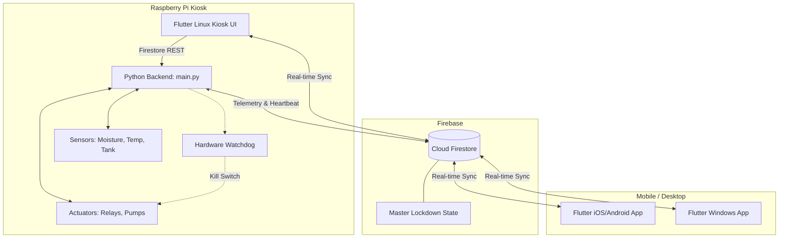
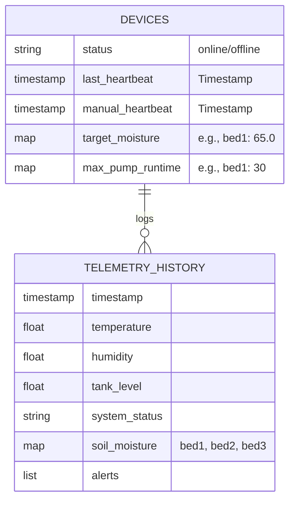
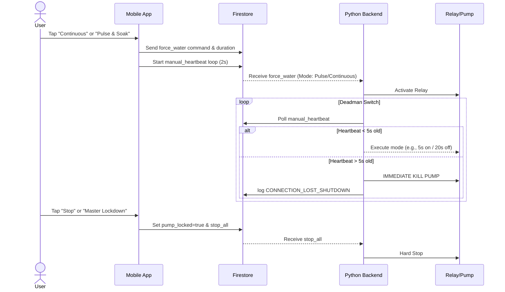

# Smart Sprout: Defense Preparation and Comprehensive Documentation

## Table of Contents
1. [System Overview](#1-system-overview)
2. [System Architecture](#2-system-architecture)
3. [UI/UX Documentation](#3-uiux-documentation)
4. [Mobile Application Functions](#4-mobile-application-functions)
5. [Detailed Cloud & Firebase Operations](#5-detailed-cloud--firebase-operations)
6. [Hardware Setup](#6-hardware-setup)
7. [Testing & Limitations](#7-testing--limitations)
8. [Defense Q&A Preparation](#8-defense-qa-preparation)
9. [Future Recommendations](#9-future-recommendations)

---

## 1. System Overview

### Project Name
**Smart Sprout**

### Purpose of the System
Smart Sprout is an intelligent, automated, and precision-driven IoT irrigation and plant monitoring system. It provides continuous monitoring of soil moisture, ambient temperature, humidity, and water tank levels. The system enables users to automate watering routines, preventing overwatering or underwatering, through custom thresholds, safety parameters, and remote mobile access.

### Target Users
- **Urban Gardeners and Homeowners**: Managing indoor and outdoor potted plants.
- **Small-Scale Farmers/Agricultural Hobbyists**: Individuals looking for an automated irrigation solution.
- **IoT Enthusiasts and Researchers**: Interested in precision agriculture.

### Platforms Supported
- **Mobile (Android/iOS)**: Premium experience with adaptive shadows, smooth hero transitions, and space-efficient notification system.
- **Windows Desktop**: Adaptive layout with hover effects and specialized scrollbars for mouse/keyboard interaction.
- **Raspberry Pi (Linux Kiosk)**: High-performance lite UI with GPU-safe rendering (no heavy glassmorphism), serving as the primary offline control hub.

### System Architecture Overview
The system relies on a **Zero-Trust Architecture** that bridges a Raspberry Pi local environment and a cloud environment:
- **Frontend**: Flutter applications spanning mobile, windows, and Linux providing UI interactions.
- **Backend (Hardware)**: Python-based backend running on the Raspberry Pi handling hardware inputs/outputs (sensors, relays, pump safety watchdogs).
- **Database / Cloud**: Google Cloud Firestore acting as the central state synchronization layer between the hardware and mobile devices.

### Technologies Used
- **Frontend**: Flutter, Dart, Riverpod (State Management), GoRouter.
- **Hardware**: Raspberry Pi 4, Capacitive Soil Moisture Sensors, BME280 (Temp/Hum/Pres), ADS1115 (ADC), 4-Channel Relay Module, Submersible Pumps, Normally Closed (NC) Solenoid Valves, 12V 8A DC Adapter, XL4016 High-Current Buck Module (8A), Active Ventilation (Exhaust Fan).

---

## 2. System Architecture

### Architecture Diagram (Deployment Diagram)



### Flow Diagrams for Defense

#### 1. System Flow Diagram
1. The **Hardware Unit** (Raspberry Pi) polls plant sensors every X seconds.
2. The **Python Backend** determines if the soil is below the *target_moisture* and initiates watering if the auto-strategy permits.
3. Telemetry is uploaded periodically (Differential Sync) to **Firestore**.
4. The **Flutter Apps** listen to Firestore and update the visual dashboards in real time.
5. A user triggers a manual pump command -> App updates Firestore -> Pi queries Firestore and activates the pump while monitoring the "Dead-Man's Switch" heartbeat.

#### 2. ERD (Entity-Relationship Diagram) - Data Structure
Firestore is a NoSQL database; structured primarily around documents.


#### 3. Sequence Diagram: Mobile Manual Watering


#### 4. Use Case Diagram
```mermaid
usecaseDiagram
    actor User
    actor RaspberryPi_System
    
    User --> (View Dashboard)
    User --> (Adjust Moisture Targets)
    User --> (Start/Stop Manual Watering)
    User --> (View System Health)
    
    RaspberryPi_System --> (Poll Sensor Telemetry)
    RaspberryPi_System --> (Upload Telemetry to Cloud)
    RaspberryPi_System --> (Execute Auto-Watering Pulse & Soak)
    RaspberryPi_System --> (Execute Hardware Safety Kill)
```

---

## 3. UI/UX Documentation

### Screens and Layouts
1. **Main Dashboard**: 
   - Displays weather summaries, tank levels, and the primary "Zone Cards" representing active garden zones.
   - **Interactions**: Tapping a Zone Card reveals detailed historical stats or manual triggers.
   - **Data**: Reads temperature, humidity, and calculated soil moisture relative to calibration.
2. **Control Screen**:
   - Contains smart-toggle pump buttons and the **Master Lockdown Switch**.
   - **Interactions**: Toggles initiate either Continuous or Pulse & Soak manual runs. The Lockdown Switch instantly sets `pump_locked` to true, requiring a manual "Release" to unlock.
3. **Calibration & Settings**:
   - Sliders to configure `SOIL_DRY` and `SOIL_WET` capacities with direct numeric input support.
   - Dual-input fields mapping the *target_moisture* and *max_pump_runtime*.
   - **Interactions**: Optimistic UI immediately reflects values before the network sync executes.
4. **System Health / Alerts**:
   - Visual display of CPU temps, memory utilization, and historical error logs.

### Navigation Flow
- Shell/BottomNavigationBar governs primary tabs: **Home** (Dashboard) <-> **Controls** <-> **Settings** <-> **Health**.

---

## 4. Mobile Application Functions

The Flutter mobile application serves as the primary remote control interface for the system. Here is a breakdown of every core function:

### 1. The Dashboard (Home)
- **Live Sensor Cards**: Displays current Soil Moisture, Temperature, Humidity, and Tank Level.
- **Sync Now Button**: A manually triggered Force Sync that commands the Pi to bypass Eco-Mode and immediately push the freshest sensor data to the cloud.
- **Zone Cards**: Represent the specific planter beds. They change color based on health (Green=Good, Warning=Low/Fault). Tapping them leads to the Plant Selection screen.

### 2. System Health Screen
- **Controller Status**: Confirms if the Raspberry Pi is online by checking the `last_heartbeat` timestamp. If it is stale by >120 seconds, the app declares it offline.
- **Maintenance Wrench**: If the Pi detects hardware disconnects (e.g., I2C bus fails or sensor unplugs), it sends a sentinel value (`-1.0`). The app reads this and displays a "FAULT" state with a warning icon, automatically disabling auto-watering for safety.

### 3. Control Screen (Manual Operations)
- **Pump Toggles**: Allows the user to select between "Continuous" and "Pulse & Soak" watering. Tapping the button writes a `force_water` command to Firebase.
- **Master Lockdown Switch**: A critical safety toggle. When activated, it writes `pump_locked = true` to the cloud. The Pi receives this instantly and permanently refuses to turn on the pumps—even for auto-watering—until the user manually releases the lockdown.
- **Auto-Watering Strategies**: Users can switch the autonomous system between *Sensor Threshold* (waters when soil gets dry) or *Timer Schedule* (waters at a specific time daily).

### 4. Calibration Screen
- Allows precise tuning of the raw analog bounds for 0% (Dry) and 100% (Wet) moisture.
- Users can input direct raw analog values, or press the **"Run Wet/Dry Calibration"** buttons. These buttons queue Firebase commands (`run_wet_calibration`) which tell the Pi to physically read the sensor 10 times, calculate the average, and save it directly to the Pi's internal storage.

### 5. Settings & Account Management
- **Device Switcher**: The app can store up to 5 unique devices (Device ID + PIN), allowing the user to seamlessly swap between different Smart Sprout setups without logging out.
- **Device Rename**: Users can give their hardware nicknames (e.g., "Front Porch Sprout").
- **System Controls**: Advanced commands to `RESTART_APP` or `REBOOT_PI` securely over the cloud if the Pi experiences OS-level freezing.

---

## 5. Detailed Cloud & Firebase Operations (How it runs every function)

To prepare for your defense, it is critical to understand **exactly** how the Cloud connects the User to the Hardware. The system operates on an asynchronous NoSQL database called Google Cloud Firestore.

### A. How Commands flow (User -> App -> Cloud -> Pi)
When you press a button on the app (e.g., "Turn Pump On" or "Run Wet Calibration"):
1. The **Flutter App** creates a new document inside a special `commands/` subcollection in Firestore. 
2. The payload looks like this: `{"command": "force_water", "processed": false, "timestamp": NOW}`.
3. The **Raspberry Pi** runs a continuous background thread utilizing `firebase_admin.firestore.on_snapshot()`. This function "listens" to the cloud 24/7.
4. The moment the new document hits the cloud, Google pushes it to the Pi.
5. The Pi's `handle_firebase_command()` function reads the command, triggers the physical relay (turning the pump on), and then updates the cloud document to `{"processed": true}` so it doesn't run it again.

### B. How Data flows (Pi -> Cloud -> App)
Instead of spamming the database every second (which would crash the quota), the system employs **Differential Sync** and **Eco-Mode**.
1. **Local Reads**: The Pi physically reads the soil sensors via I2C every **3 seconds**.
2. **The Cloud Gate**: Before sending that data to Firebase, the Pi checks three rules:
   - **Rule 1 (Eco-Mode)**: Has it been 30 minutes since the last push? If yes, push.
   - **Rule 2 (Differential Sync)**: Did the moisture jump by more than 3%? Or the temperature by 1.5°C? If yes, push immediately.
   - **Rule 3 (Force Sync)**: Did the user tap "Sync Now" in the app? If yes, push immediately.
3. If none of these are met, the Pi stays quiet and saves bandwidth.
4. When it *does* push, it overwrites the main device document in Firestore. The Flutter app is "listening" (via Riverpod Streams) to this document and instantly updates the mobile screen UI locally without requiring a manual refresh.

### C. The Dead-Man's Switch (Safety)
If a user is manually watering via the app, what happens if their phone loses internet? 
- **The Cloud Fix**: While holding the water button, the mobile app writes a "Heartbeat" timestamp to Firestore every 2 seconds.
- **The Pi Check**: Before the Pi fires the relay, it reads that timestamp. If the timestamp is older than 5 seconds (meaning the phone disconnected), the Pi **aborts** the pump operation to prevent flooding the house.

---

## 6. Hardware Setup

### Hardware Components Used
1. **Raspberry Pi 4** (The core edge controller, powered by 5.1V via Homesaya USB Jack).
2. **Capacitive Soil Moisture Sensors (v1.2)** (Reads analog capacitance, immune to corrosion).
3. **ADS1115 16-bit ADC** (Converts analog soil sensors to digital I2C for the Pi).
4. **BME280 Environment Module** (Precision Temperature, Humidity, and Pressure via I2C).
5. **4-Channel 5V Relay Module (SRD-05VDC)** (Acting as a galvanic isolation barrier).
6. **Submersible USB Pump** (Spliced and powered by the Buck Module secondary output).
7. **Normally Closed (NC) 12V Solenoid Valves** (Failsafe state; wired to NO relay terminals for logic isolation).
8. **XKC-Y26-V Non-contact Liquid Level Sensor** (With 1kΩ/2kΩ voltage divider for 3.3V GPIO safety).
9. **XL4016 8A DC-DC Buck Module** (Centralized power distributor from 12V 8A source).
10. **Active Ventilation System** (Exhaust Fan integrated for thermal management of XL4016 and Pi 4).

### Power & Logic Strategy
- **Single-Source Input**: A single 12V DC adapter powers both the solenoids and the step-down module.
- **BCM Mapping**: All pins are strictly mapped using Broadcom (BCM) numbering in the `SensorManager.py` backend.
- **Voltage Protection**: Level shifting for 5V sensors and opto-isolation on relays to protect the Pi 4's logic rail.

### Operations Environment
- **OS**: Raspberry Pi OS Lite or Desktop (Debian-based).
- **Auto-start**: Controlled via `systemd` writing to `smartsprout.service`, ensuring Python scripts reboot gracefully on power failure.
- **Kiosk Mode**: Uses `Wayland/Mutter` or `X11` to launch the compiled Flutter Linux application in fullscreen on boot.

---

## 7. Testing & Limitations

### Testing Methodologies Applied
- **Differential Sync Validation**: Tested that telemetry logs only cloud-push when moisture changes by >3% or an alert is thrown, protecting Firestore quota overhead.
- **Watchdog Trigger**: Forcing the pump script into an infinite loop to verify `pump_watchdog.py` kills the GPIO relay independently within 30s.

### Limitations
- **Sensor Drift**: Capacitive sensors slowly drift as soil compactions change over months. They require occasional recalibration in the UI.
- **Local Network Dependency**: While the Zero-Trust architecture blocks exploits, if the home WiFi router goes fully offline without standard DNS, the mobile App won't sync (the Pi local touch app *will* maintain operation).
- **Water Capacity limitation**: 5-gallon tank runs dry entirely dependent on the pump draw limit—measuring tank volume is critical.

---

## 8. Defense Q&A Preparation

**Q1: Why rely on Cloud Firestore instead of local MQTT/Bluetooth?**
*Answer:* **Zero-Trust Architecture & Scalability.** Local MQTT servers introduce local network attack vectors and require users to manage complex router setups. Utilizing Firestore guarantees that data is encrypted in transit and the system can be scaled and controlled securely from anywhere in the world without exposing network vulnerabilities.

**Q2: How do you prevent the pumps from flooding the user's house?**
*Answer:* We implemented a multi-layered safety strategy:
1. **Master Lockdown Switch**: A global software kill-switch that locks the system's state.
2. **Pulse & Soak System**: Reduces hydraulic pressure and prevents soil saturation runoff.
3. **Dead-Man's Switch**: Kills the pump if the mobile app disconnects for >5 seconds during manual operation.
4. **NC Solenoid Valves**: We use **Normally Closed** valves wired to **Normally Open** relay terminals. They require active power and logic confirmation to open, ensuring they remain shut during power loss or system crashes.
5. **Hardware Watchdog**: An isolated script directly monitoring GPIO limits duration to 120s regardless of software logic.
6. **Thermal Safety**: Active ventilation prevents thermal throttling that could lead to sensor lag or software hang-ups.

**Q3: What happens if the internet goes down?**
*Answer:* The system follows a **Local-First** philosophy. The Raspberry Pi maintains its scheduled auto-watering routines entirely offline. While the mobile app loses remote control, the physical touchscreen kiosk on the Pi remains fully functional for manual triggers and calibration.

**Q4: How did you handle the UI performance bottleneck on the low-powered Raspberry Pi?**
*Answer:* Platform-specific optimizations. Previously, we utilized Flutter's `Platform.isLinux` conditions to disable heavy GPU calculations like BackdropFilters (glassmorphism) and restricted the image cache size significantly for the Pi 3B. However, with the transition to the Raspberry Pi 4 (4GB RAM), we have enabled the full premium UI (glassmorphism, animations) on the Linux Kiosk to match the mobile experience, eliminating the need for strict visual regressions.

**Q5: How is this system scalable?**
*Answer:* Expanding the system is horizontally scalable through Firebase. By appending a new `device_id`, the user can buy a second Smart Sprout kit, place it in their backyard, and manage it seamlessly from the exact same mobile app by merely toggling device selection. 

---

## 9. Future Recommendations

1. **Admin & Analytics Dashboard**: Implementing a web-based comprehensive reporting tool utilizing Firebase BigQuery.
2. **AI Integration**: Taking weather APIs and predictive models to halt watering if rain is expected.
3. **Connectivity Diagnostics**: Future iterations of the 'System Health' screen will include a specific 'Last Heartbeat' timestamp to distinguish between hardware faults and network outages.
4. **Advanced Offline Mode**: Developing an ad-hoc Bluetooth Low Energy (BLE) fallback.
4. **Data Backup/Recovery Plans**: Automating nightly Firebase storage exports to GCP Cloud Storage.
5. **Push Notifications**: Utilizing Firebase Cloud Messaging (FCM) to trigger iOS/Android banner notifications the moment the `system_status` hits `tank_low` or `CONNECTION_LOST_SHUTDOWN`.
6. **User Accounts & Role-Based Access**: Multi-tenancy configurations so a family can have 'admin' rights (changing parameters) vs 'viewer' rights (just viewing stats).
