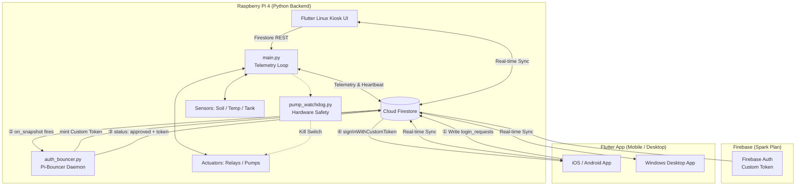
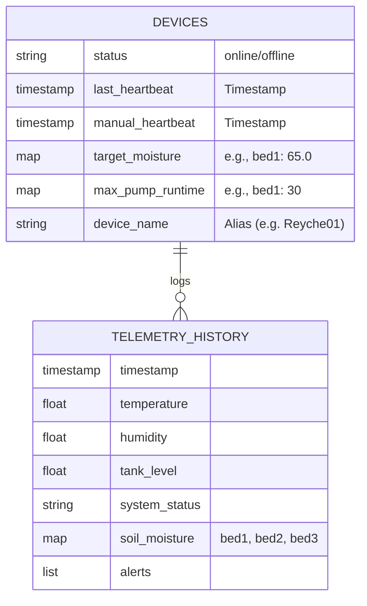
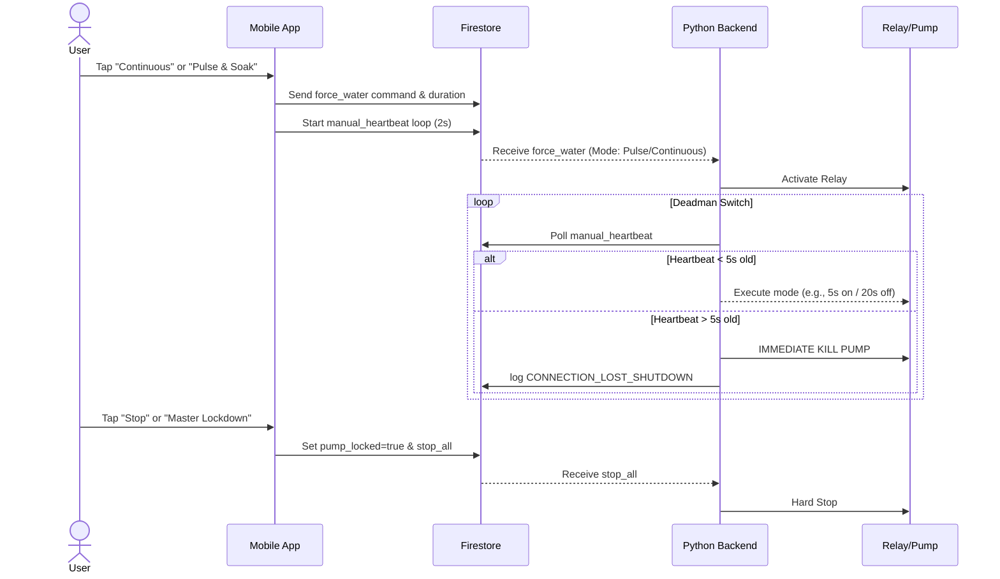
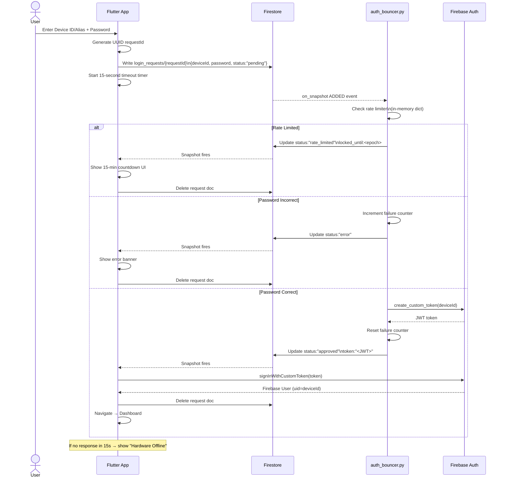
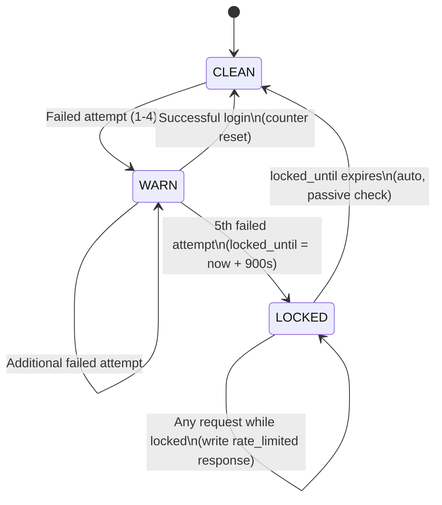

# Smart Sprout: Defense Preparation and Comprehensive Documentation

## Table of Contents
1. [System Overview](#1-system-overview)
2. [System Architecture](#2-system-architecture)
3. [Pi-Bouncer Authentication Architecture](#3-pi-bouncer-authentication-architecture)
4. [UI/UX Documentation](#4-uiux-documentation)
5. [Mobile Application Functions](#5-mobile-application-functions)
6. [Analytics Engine](#6-analytics-engine)
7. [Detailed Cloud & Firebase Operations](#7-detailed-cloud--firebase-operations)
8. [Hardware Setup](#8-hardware-setup)
9. [Testing & Limitations](#9-testing--limitations)
10. [Defense Q&A Preparation](#10-defense-qa-preparation)
11. [Future Recommendations](#11-future-recommendations)
12. [Intellectual Property & Anti-Tamper Strategies](#12-intellectual-property--anti-tamper-strategies)

---

## 1. System Overview

### Project Name
**Smart Sprout**

### Purpose of the System
Smart Sprout is an intelligent, automated, and precision-driven IoT irrigation and plant monitoring system. It provides continuous monitoring of soil moisture, ambient temperature, humidity, and water tank levels. The system enables users to automate watering routines, preventing overwatering or underwatering, through custom thresholds, safety parameters, and remote mobile access.

### Target Users
- **Urban Gardeners and Homeowners**: Managing indoor and outdoor potted plants.
- **Small-Scale Farmers/Agricultural Hobbyists**: Individuals looking for an automated irrigation solution.
- **IoT Enthusiasts and Researchers**: Interested in precision agriculture.

### Platforms Supported
- **Mobile (Android/iOS)**: Premium experience with adaptive shadows, smooth hero transitions, and space-efficient notification system.
- **Windows Desktop**: Adaptive layout with hover effects and specialized scrollbars for mouse/keyboard interaction.
- **Raspberry Pi (Linux Kiosk)**: High-performance lite UI with GPU-safe rendering (no heavy glassmorphism), serving as the primary offline control hub.

### System Architecture Overview
The system relies on a **Zero-Trust Architecture** that bridges a Raspberry Pi local environment and a cloud environment:
- **Frontend**: Flutter applications spanning mobile, windows, and Linux providing UI interactions.
- **Backend (Hardware)**: Python-based backend running on the Raspberry Pi handling hardware inputs/outputs (sensors, relays, pump safety watchdogs).
- **Database / Cloud**: Google Cloud Firestore acting as the central state synchronization layer between the hardware and mobile devices.

### Technologies Used
- **Frontend**: Flutter, Dart, Riverpod (State Management), GoRouter.
- **Hardware**: Raspberry Pi 4, Capacitive Soil Moisture Sensors, BME280 (Temp/Hum/Pres), ADS1115 (ADC), 4-Channel Relay Module, Submersible Pumps, Normally Closed (NC) Solenoid Valves, 12V 8A DC Adapter, XL4016 High-Current Buck Module (8A), Active Ventilation (Exhaust Fan).

---

## 2. System Architecture

### Architecture Diagram (Deployment Diagram)



### Flow Diagrams for Defense

#### 1. System Flow Diagram
1. The **Hardware Unit** (Raspberry Pi) polls plant sensors every 3 seconds.
2. The **Python Backend** determines if the soil is below the *target_moisture* and initiates watering if the auto-strategy permits.
3. Telemetry is uploaded periodically (Differential Sync) to **Firestore**.
4. The **Flutter Apps** listen to Firestore and update the visual dashboards in real time.
5. A user logs in → App writes request to `login_requests/` → **auth_bouncer.py** validates PIN server-side → mints Custom Token → App authenticates.
6. A user triggers a manual pump command → App updates Firestore → Pi queries Firestore and activates the pump while monitoring the Dead-Man's Switch heartbeat.

#### 2. ERD (Entity-Relationship Diagram) - Data Structure
Firestore is a NoSQL database; structured primarily around documents.


#### 3. Sequence Diagram: Mobile Manual Watering


#### 4. Use Case Diagram
```mermaid
usecaseDiagram
    actor User
    actor RaspberryPi_System
    
    User --> (View Dashboard)
    User --> (Adjust Moisture Targets)
    User --> (Start/Stop Manual Watering)
    User --> (View System Health)
    
    RaspberryPi_System --> (Poll Sensor Telemetry)
    RaspberryPi_System --> (Upload Telemetry to Cloud)
    RaspberryPi_System --> (Execute Auto-Watering Pulse & Soak)
    RaspberryPi_System --> (Execute Hardware Safety Kill)
```

---

## 3. UI/UX Documentation

### Screens and Layouts
1. **Main Dashboard**: 
   - Displays weather summaries, tank levels, and the primary "Zone Cards" representing active garden zones.
   - **Interactions**: Tapping a Zone Card reveals detailed historical stats or manual triggers.
   - **Data**: Reads temperature, humidity, and calculated soil moisture relative to calibration.
2. **Control Screen**:
   - Contains smart-toggle pump buttons and the **Master Lockdown Switch**.
   - **Interactions**: Toggles initiate either Continuous or Pulse & Soak manual runs. The Lockdown Switch instantly sets `pump_locked` to true, disables all manual zone controls simultaneously, and explicitly locks the autonomous strategy toggle until explicitly "Released" by the user.
3. **Calibration & Settings**:
   - Sliders to configure `SOIL_DRY` and `SOIL_WET` capacities with direct numeric input support.
   - Dual-input fields mapping the *target_moisture* and *max_pump_runtime*.
   - **Interactions**: Optimistic UI immediately reflects values before the network sync executes.
4. **System Health / Alerts**:
   - Visual display of CPU temps, memory utilization, and historical error logs.

### Navigation Flow
- Shell/BottomNavigationBar governs primary tabs: **Home** (Dashboard) <-> **Controls** <-> **Settings** <-> **Health**.

---

## 4. Mobile Application Functions

The Flutter mobile application serves as the primary remote control interface for the system. Here is a breakdown of every core function:

### 1. The Dashboard (Home)
- **Live Sensor Cards**: Displays current Soil Moisture, Temperature, Humidity, and Tank Level.
- **Sync Now Button**: A manually triggered Force Sync that commands the Pi to bypass Eco-Mode and immediately push the freshest sensor data to the cloud.
- **Zone Cards**: Represent the specific planter beds. They change color based on health (Green=Good, Warning=Low/Fault). Tapping them leads to the Plant Selection screen.

### 2. System Health Screen
- **Controller Status**: Confirms if the Raspberry Pi is online by checking the `last_heartbeat` timestamp. If it is stale by >120 seconds, the app declares it offline.
- **Maintenance Wrench**: If the Pi detects hardware disconnects (e.g., I2C bus fails or sensor unplugs), it sends a sentinel value (`-1.0`). The app reads this and displays a "FAULT" state with a warning icon, automatically disabling auto-watering for safety.

### 3. Control Screen (Manual Operations)
- **Pump Toggles**: Allows the user to select between "Continuous" and "Pulse & Soak" watering. Tapping the button writes a `force_water` command to Firebase.
- **Master Lockdown Switch**: A critical safety toggle. When activated, it writes `pump_locked = true` to the cloud. The Pi receives this instantly and refuses to run the pumps. Concurrently, the mobile app UI greys out and explicitly disables all manual pump buttons and automatic watering toggles to prevent accidental queues while locked.
- **Auto-Watering Strategies**: Users can switch the autonomous system between *Sensor Threshold* (waters when soil gets dry) or *Timer Schedule* (waters at a specific time daily).

### 4. Calibration Screen
- Allows precise tuning of the raw analog bounds for 0% (Dry) and 100% (Wet) moisture.
- Users can input direct raw analog values, or press the **"Run Wet/Dry Calibration"** buttons. These buttons queue Firebase commands (`run_wet_calibration`) which tell the Pi to physically read the sensor 10 times, calculate the average, and save it directly to the Pi's internal storage.

### 5. Settings & Account Management
- **Device Switcher**: The app can store up to 5 unique devices (Device ID + PIN), allowing the user to seamlessly swap between different Smart Sprout setups. Redundant nickname editing in this screen was removed to streamline UI.
- **Persistent Dark Mode**: Fully localized, theme-aware Dark Mode system that cascades through all dialogs, bottom sheets, and status overlays for improved accessibility.
- **System Controls**: Advanced commands to `RESTART_APP` or `REBOOT_PI` securely over the cloud if the Pi experiences OS-level freezing.
- **Optimized UI Notifications**: SnackBar alert overlays are tuned to a 1.5-second duration for rapid, non-obtrusive feedback, alongside full Flutter deprecation resolution (`.withValues()` migration).

---

## 6. Analytics Engine

The Analytics Screen gives users a **rolling 7-day visual trend** of soil moisture and temperature using historical Firestore telemetry data. It is the only screen that performs a *batch historical query* rather than listening to a real-time stream.

### 6.1 Rolling Window

The window always covers the last **6 full days + today**, shifting forward automatically every midnight.

| Variable | Formula | Example (if today = Sun Apr 6) |
|---|---|---|
| `today` | `DateTime.now()` | Sun Apr 6 |
| `cutoff` | `today − 6 days` | Mon Mar 31 |
| `dayIndex 0` | `cutoff` | Mon (oldest) |
| `dayIndex 1` | `cutoff + 1` | Tue |
| `dayIndex 5` | `cutoff + 5` | Sat |
| `dayIndex 6` | `today` | Sun ("Today") |

> Tomorrow (Mon Apr 7) the window automatically becomes **Tue Apr 1 → Mon Apr 7**. No code change needed.

### 6.2 Formulas

#### Average Soil Moisture for Day N

Each telemetry document stores `soil_moisture` as a Firestore **Map** (`{bed1, bed2, bed3}`). The formula first averages within each document, then averages across all documents for the day:

```
Step 1 — Per-document zone average:
  soilAvg_doc = (bed1 + bed2 + bed3) / 3

Step 2 — Daily average across M valid documents:
  avgMoisture[N] = Σ(soilAvg_doc₁ + soilAvg_doc₂ + … + soilAvg_docₘ)
                  ────────────────────────────────────────────────────
                                      M
```

#### Average Temperature for Day N

```
  avgTemp[N] = Σ(temperature_doc₁ + temperature_doc₂ + … + temperature_docₘ)
               ────────────────────────────────────────────────────────────────
                                           M
```

> **Type Safety Note:** Firestore returns `int` for whole numbers (e.g., `-1`, `0`) and `double` for decimals. All fields are normalized through `safeDouble(v) = (v as num?)?.toDouble() ?? 0.0` before any arithmetic to prevent `TypeError` at runtime.

### 6.3 Data Processing Pipeline

| # | Step | Component | Detail |
|---|---|---|---|
| 1 | **Query** | `DataService.fetchWeeklyAnalytics()` | Firestore query: `timestamp >= cutoffSeconds`, ordered ascending, `.limit(500)` hard cap |
| 2 | **Group by day** | `data_service.dart` | `dayIndex = date.difference(cutoff).inDays` — maps each doc to slot 0–6 |
| 3 | **Normalize types** | `safeDouble()` helper | Converts Firestore `int`/`double`/`null` → `double` safely |
| 4 | **Zone average** | Per-document inner loop | `Σ(bed values) / count(beds)` per document |
| 5 | **Daily aggregate** | Per-day outer loop | `Σ(doc averages) / validDocs` |
| 6 | **Gap detection** | `hasData` flag | `false` if `docs.isEmpty` OR `validDocs == 0` (all parse errors) |
| 7 | **Render** | `analytics_screen.dart` | `hasData=true` → `FlSpot(x, y)`; `hasData=false` → `FlSpot.nullSpot` (chart gap) |

### 6.4 Sentinel Value: `-1.0`

The Pi writes `-1.0` when it cannot read a sensor (I2C bus failure, sensor unplugged, BME280 timeout). This value is **intentional** — it signals a hardware fault rather than disguising the failure as `0`.

| Field | Normal Range | Fault Value | Root Cause |
|---|---|---|---|
| `temperature` | 15.0 – 45.0 °C | `-1.0` | BME280 I2C read failure |
| `soil_moisture.bedN` | 0.0 – 100.0 % | `-1.0` | ADS1115 ADC / capacitive sensor disconnect |
| `humidity` | 10.0 – 100.0 % | `-1.0` | BME280 I2C read failure |
| `tank_level` | `True` / `False` | N/A | XKC-Y26-V is binary (digital GPIO) |

### 6.5 Chart Behavior Reference

| Condition | `hasData` | Line on Chart | X-Axis Bottom Label |
|---|---|---|---|
| Pi published data, sensors healthy | `true` | Segment at real value + colored dot | `Mon` + ● dot (Green) |
| Pi published data, sensors offline | `true` | Segment at `-1.0` + colored dot | `Mon` + ● dot (Yellow) |
| Pi was off — zero Firestore docs | `false` | Gap (invisible) | `Mon` + `—` dash (Red) |
| All docs on day failed parse | `false` | Gap (invisible) | `Mon` + `—` dash (Red) |
| dayIndex == 6 (today) | either | Normal rendering | `Today` in accent color (bold) |

### 6.6 Quota & Cache Design

| Operation | Trigger | Firestore Reads |
|---|---|---|
| Fresh analytics fetch | Screen opened (first time or cache expired) | 1 query × up to 500 doc reads |
| Cache hit | Screen re-opened within 1 hour | **0 reads** |
| `limit(500)` guard | Always enforced | Prevents runaway reads on large telemetry collections |
| Linux Kiosk | Platform check `Platform.isLinux` | Always returns synthetic `hasData: false` data — **0 Firestore reads** |

---

## 7. Detailed Cloud & Firebase Operations (How it runs every function)

To prepare for your defense, it is critical to understand **exactly** how the Cloud connects the User to the Hardware. The system operates on an asynchronous NoSQL database called Google Cloud Firestore.

### A. How Commands flow (User -> App -> Cloud -> Pi)
When you press a button on the app (e.g., "Turn Pump On" or "Run Wet Calibration"):
1. The **Flutter App** creates a new document inside a special `commands/` subcollection in Firestore. 
2. The payload looks like this: `{"command": "force_water", "processed": false, "timestamp": NOW}`.
3. The **Raspberry Pi** runs a continuous background thread utilizing `firebase_admin.firestore.on_snapshot()`. This function "listens" to the cloud 24/7.
4. The moment the new document hits the cloud, Google pushes it to the Pi.
5. The Pi's `handle_firebase_command()` function reads the command, triggers the physical relay (turning the pump on), and then updates the cloud document to `{"processed": true}` so it doesn't run it again.

### B. How Data flows (Pi -> Cloud -> App)
Instead of spamming the database every second (which would crash the quota), the system employs **Differential Sync** and **Eco-Mode**.
1. **Local Reads**: The Pi physically reads the soil sensors via I2C every **3 seconds**.
2. **The Cloud Gate**: Before sending that data to Firebase, the Pi checks four rules:
   - **Rule 1 (Eco-Mode)**: Has it been 30 minutes since the last push? If yes, push everything (History + Status).
   - **Rule 2 (Differential Sync)**: Did moisture jump by >8%? Or temp by >3.0°C? If yes, push immediately (Status only to save history quota) — but strictly limited to maximum once every 60 seconds to suppress sensor jitter.
   - **Rule 3 (Force Sync)**: Did the user tap "Sync Now" in the app? If yes, push immediately.
   - **Rule 4 (Live Watering Bypass)**: Is the pump currently ON? If yes, bypass the 60s cooldown and the 8% threshold completely. Stream data every 3 seconds so the mobile app gets a real-time, zero-delay premium experience while watering.
3. If none of these are met, the Pi stays quiet and saves bandwidth.
4. When it *does* push, it overwrites the main device document in Firestore. The Flutter app is "listening" (via Riverpod Streams) to this document and instantly updates the mobile screen UI locally without requiring a manual refresh.

### C. Pi-Bouncer Authentication Architecture (v2.0)

The system uses a **hardware-rooted, server-side authentication model** — the PIN is validated exclusively on the Raspberry Pi, never on the mobile client.

#### Why the Old Architecture Was Insecure
The previous architecture used Firebase Anonymous Sign-In and compared the PIN **client-side** by reading `devices/{deviceId}.hashed_pin` from Firestore. This meant:
- Any attacker with a `deviceId` could attempt all 10,000 possible 4-digit PINs with zero server-side throttle.
- The PIN hash was exposed to the Firestore client SDK — readable in logs or intercepted.

#### The Pi-Bouncer Solution

| Step | Actor | Action |
|---|---|---|
| ① | Flutter App | Generate UUID `requestId`. Write `login_requests/{requestId}` with `{deviceId, pin, status:"pending"}` |
| ② | Firestore | `on_snapshot` fires on the Pi's `auth_bouncer.py` listener |
| ③ | Pi (auth_bouncer.py) | Check in-memory rate limiter. If locked → write `status:"rate_limited"` |
| ④ | Pi (auth_bouncer.py) | SHA-256 hash incoming PIN. Compare against stored hash in `device_config.json` |
| ⑤ | Pi (auth_bouncer.py) | On match: call `firebase_auth.create_custom_token(deviceId)` via Admin SDK |
| ⑥ | Pi (auth_bouncer.py) | Write `{status:"approved", token:"<JWT>"}` back to the request doc |
| ⑦ | Flutter App | Receive `approved` → call `FirebaseAuth.signInWithCustomToken(token)` → delete request doc |

#### Rate Limiting

| Parameter | Value |
|---|---|
| Max failed attempts | 5 per deviceId |
| Lockout duration | 15 minutes |
| State | In-memory dict (thread-safe via `threading.Lock`) |
| Auto-expiry | Passive — checks `time.time() > locked_until` on each request |
| Client feedback | `locked_until` epoch timestamp returned for countdown UI |

#### Firestore Security Rules — Key Properties

| Collection | Create Rule | Read Rule |
|---|---|---|
| `devices/{deviceId}` | Pi Admin SDK only | `request.auth.uid == deviceId` |
| `login_requests/{requestId}` | Anyone (payload validated) | Anyone (UUID = 122-bit secret) |

**Why `login_requests` read is open:** The `requestId` is a UUID v4 with 122 bits of entropy. Guessing it is computationally equivalent to breaking AES-128. The document path *is* the access credential — the same pattern used by Firebase Dynamic Links.

#### 2. **Raspberry Pi (Firebase Admin SDK)**: The Python backend uses the **Firebase Admin SDK** with a locally stored `firebase-adminsdk.json` Service Account key. This grants Server-to-Server privileges to publish telemetry, listen to `commands/`, and **mint Custom Tokens** — the key capability that enables the Pi-Bouncer.

### D. The Dead-Man's Switch (Safety)
If a user is manually watering via the app, what happens if their phone loses internet? 
- **The Cloud Fix**: While holding the water button, the mobile app writes a "Heartbeat" timestamp to Firestore every 2 seconds.
- **The Pi Check**: Before the Pi fires the relay, it reads that timestamp. If the timestamp is older than 5 seconds (meaning the phone disconnected), the Pi **aborts** the pump operation to prevent flooding the house.

---

## 6. Hardware Setup

### Hardware Components Used
1. **Raspberry Pi 4** (The core edge controller, powered by 5.1V via Homesaya USB Jack).
2. **Capacitive Soil Moisture Sensors (v1.2)** (Reads analog capacitance, immune to corrosion).
3. **ADS1115 16-bit ADC** (Converts analog soil sensors to digital I2C for the Pi).
4. **BME280 Environment Module** (Precision Temperature, Humidity, and Pressure via I2C).
5. **4-Channel 5V Relay Module (SRD-05VDC)** (Acting as a galvanic isolation barrier).
6. **Submersible USB Pump** (Spliced and powered by the Buck Module secondary output).
7. **Normally Closed (NC) 12V Solenoid Valves** (Failsafe state; wired to NO relay terminals for logic isolation).
8. **XKC-Y26-V Non-contact Liquid Level Sensor** (With 1kΩ/2kΩ voltage divider for 3.3V GPIO safety).
9. **XL4016 8A DC-DC Buck Module** (Centralized power distributor from 12V 8A source).
10. **Active Ventilation System** (Exhaust Fan integrated for thermal management of XL4016 and Pi 4).

### Power & Logic Strategy
- **Single-Source Input**: A single 12V DC adapter powers both the solenoids and the step-down module.
- **BCM Mapping**: All pins are strictly mapped using Broadcom (BCM) numbering in the `SensorManager.py` backend.
- **Voltage Protection**: Level shifting for 5V sensors and opto-isolation on relays to protect the Pi 4's logic rail.

### Operations Environment
- **OS**: Raspberry Pi OS Lite or Desktop (Debian-based).
- **Auto-start**: Controlled via `systemd` writing to `smartsprout.service`, ensuring Python scripts reboot gracefully on power failure.
- **Kiosk Mode**: Uses `Wayland/Mutter` or `X11` to launch the compiled Flutter Linux application in fullscreen on boot.

---

## 7. Testing & Limitations

### Testing Methodologies Applied
- **Differential Sync Validation**: Tested that telemetry logs only cloud-push when moisture changes by >3% or an alert is thrown, protecting Firestore quota overhead.
- **Watchdog Trigger**: Forcing the pump script into an infinite loop to verify `pump_watchdog.py` kills the GPIO relay independently within 30s.

### Limitations
- **Sensor Drift**: Capacitive sensors slowly drift as soil compactions change over months. They require occasional recalibration in the UI.
- **Local Network Dependency**: While the Zero-Trust architecture blocks exploits, if the home WiFi router goes fully offline without standard DNS, the mobile App won't sync (the Pi local touch app *will* maintain operation).
- **Water Capacity limitation**: 5-gallon tank runs dry entirely dependent on the pump draw limit—measuring tank volume is critical.

---

---

## 3. Pi-Bouncer Authentication Architecture

### Sequence Diagram: Login Flow



### Rate Limiter State Machine



### Auth State → UI Mapping

| AuthState | isLoading | isRateLimited | error | UI Component |
|---|---|---|---|---|
| Idle | false | false | null | Login form |
| Hardware Offline | false | false | "Hardware Offline..." | Orange Wi-Fi Off banner |
| Incorrect Password | false | false | "Incorrect Password." | Red error banner |
| Rate Limited | false | true | Lockout message | Amber countdown (MM:SS) |
| Approved | false | false | null | Green snackbar → Dashboard |

---

## 9. Defense Q&A Preparation

**Q: How does the Analytics screen display a 7-day rolling window of soil moisture and temperature?**
*Answer:* The `DataService.fetchWeeklyAnalytics()` method queries the `telemetry` subcollection for documents with a `timestamp` ≥ today minus 6 days (the "cutoff"), hard-capped at 500 documents. Each document is assigned to a `dayIndex` (0 = 6 days ago, 6 = today) by computing `date.difference(cutoff).inDays`. For each day, the method averages all zone soil moisture values per document, then averages those across all valid documents for the day. The same is done for temperature. If a day has zero Firestore documents, it receives `hasData: false` and the chart renders a visible **gap** (using `FlSpot.nullSpot`) instead of a misleading `0`. The X-axis always spans all 7 positions (`minX: 0, maxX: 6`) with real calendar day names so the chart is always readable.

**Q: Why does the analytics chart sometimes show `-1` instead of `0`?**
*Answer:* `-1.0` is a **sentinel fault value** written by the Pi when a sensor read fails (e.g., BME280 I2C timeout, capacitive sensor unplugged). It intentionally distinguishes a *hardware fault* (`-1`) from *no data at all* (gap). A `0` in the chart would falsely imply dry soil or freezing temperature, while `-1` clearly indicates a Pi-was-running-but-sensor-was-offline state.

**Q: What was the original authentication vulnerability and how did you fix it?**
*Answer:* The original architecture compared a 4-digit PIN **client-side** — the Flutter app read `hashed_pin` from Firestore and compared locally. An attacker with a leaked `deviceId` could trivially intercept this and attempt all 10,000 PINs with no server-side throttle. We solved this with the **Pi-Bouncer architecture v2**: 
1. We upgraded from 4-digit PINs to Enterprise Passwords (8+ chars, upper/lower, numbers, symbols) stored on the Pi using **PBKDF2-HMAC-SHA256 (600k iterations)** with random per-device salting to defeat offline dictionary attacks.
2. We implemented **Strict Alias Login**, meaning if the user sets an alias (e.g., "Reyche01"), the Pi rejects attempts using the raw Hardware MAC ID, mitigating factory hardware ID leaks.
3. `auth_bouncer.py` validates passwords exclusively on trusted hardware using constant-time verification (`hmac.compare_digest`) to prevent timing attacks, enforces a 15-minute lockout after 5 failures, and mints a Firebase Custom Token. The Flutter app never touches the stored hash.

**Q: How does the Pi mint a Custom Token if you're on the Spark (Free) plan?**
*Answer:* Custom Token minting is a feature of the **Firebase Admin SDK**, not Cloud Functions. The Admin SDK runs locally on the Raspberry Pi for free — it only requires a Service Account key (`firebase-adminsdk.json`). No paid plan is needed.

**Q: What prevents an attacker from spamming the `login_requests` collection?**
*Answer:* Three layers: (1) **Firestore Security Rules** validate the payload on create — enforcing strict length validation on the password (max 128 chars to prevent DB bloat), and rejecting malformed payloads. (2) **Rate limiting** on the Pi — 5 failed attempts locks the device for 15 minutes. (3) **UUID entropy** — the `requestId` is UUID v4 with 122 bits of entropy. An attacker cannot enumerate documents to find a token.

**Q1: Why rely on Cloud Firestore instead of local MQTT/Bluetooth?**
*Answer:* **Zero-Trust Architecture & Scalability.** Local MQTT servers introduce local network attack vectors and require users to manage complex router setups. Utilizing Firestore guarantees that data is encrypted in transit and the system can be scaled and controlled securely from anywhere in the world without exposing network vulnerabilities.

**Q2: How do you prevent the pumps from flooding the user's house?**
*Answer:* We implemented a multi-layered safety strategy:
1. **Master Lockdown Switch**: A global software kill-switch that physically locks out all UI buttons (both manual controls and auto-schedules) and commands the Pi to halt all logic.
2. **Pulse & Soak System**: Reduces hydraulic pressure and prevents soil saturation runoff.
3. **Dead-Man's Switch**: Kills the pump if the mobile app disconnects for >5 seconds during manual operation.
4. **NC Solenoid Valves**: We use **Normally Closed** valves wired to **Normally Open** relay terminals. They require active power and logic confirmation to open, ensuring they remain shut during power loss or system crashes.
5. **Hardware Watchdog**: An isolated script directly monitoring GPIO limits duration to 120s regardless of software logic.
6. **Thermal Safety**: Active ventilation prevents thermal throttling that could lead to sensor lag or software hang-ups.

**Q3: What happens if the internet goes down?**
*Answer:* The system follows a **Local-First** philosophy. The Raspberry Pi maintains its scheduled auto-watering routines entirely offline. While the mobile app loses remote control, the physical touchscreen kiosk on the Pi remains fully functional for manual triggers and calibration.

**Q4: How did you handle the UI performance bottleneck on the low-powered Raspberry Pi?**
*Answer:* Platform-specific optimizations. Previously, we utilized Flutter's `Platform.isLinux` conditions to disable heavy GPU calculations like BackdropFilters (glassmorphism) and restricted the image cache size significantly for the Pi 3B. However, with the transition to the Raspberry Pi 4 (4GB RAM), we have enabled the full premium UI (glassmorphism, animations) on the Linux Kiosk to match the mobile experience, eliminating the need for strict visual regressions.

**Q5: How is this system scalable?**
*Answer:* Expanding the system is horizontally scalable through Firebase. By appending a new `device_id`, the user can buy a second Smart Sprout kit, place it in their backyard, and manage it seamlessly from the exact same mobile app by merely toggling device selection. 

**Q6: How do you manage the 20,000 writes/day and 50,000 reads/day Firebase Free Tier Quotas?**
*Answer:* We faced a scenario where background operations caused a massive 43,000+ read spike. We resolved this by implementing a highly optimized **Dynamic Sync & Caching Architecture** that reduced data usage by over 90%:
1. **Analytics Query Capping & Caching:** We applied a `.limit(500)` cap to historical database queries. We also transitioned the mobile analytics provider from a volatile state to an `AsyncNotifier` with a **1-hour in-memory cache**. Navigating between screens now costs 0 additional reads.
2. **Persistent Batch Cleanups:** The Raspberry Pi automatically deletes telemetry older than 30 days. We implemented local disk persistence for the `_last_cleanup_time` so the Pi doesn't redundantly query and attempt cleanups on every system reboot.
3. **Subcollection Routing:** Sensor "jitter" (electronic noise) could cause 28,000+ writes a day. Now, periodic updates only overwrite a single Status document. 
4. **Active Filtering:** We widened the differential sync thresholds (8% moisture / 3°C temp) to ignore noise and added a strict 60-second cooldown limiter.
5. **Kiosk Local Telemetry Cache (Zero API Cost)**: We transitioned the Linux Kiosk UI to read directly from a local telemetry cache file updated seamlessly by the Pi backend. This completely eliminates Firebase REST API quota costs for the local touchscreen while achieving true real-time responsiveness.
6. **Live Bypass Mechanism & Snappy Heartbeats:** During manual watering, we bypass cooldowns to stream data every 3 seconds for zero-delay UX. To keep the app snappy when the Pi is unplugged, we maintained a 10s Pi heartbeat but aggressively optimized the mobile app's offline timeout to **25 seconds** (a fast, stable detection threshold).

**Q7: Why use a 10-second heartbeat if it's meant for "real-time" monitoring? Is a 25-second reflection delay professional?**
*Answer:* **It is an engineering trade-off between Quota Sustainability and Practical UX.** 
1. **Quota Math**: A 1-second heartbeat would consume **86,400 writes/day**, which is 432% over the Firebase Free Tier limit. A 10-second heartbeat uses only **8,640 writes/day (43%)**, leaving plenty of room for actual sensor data.
2. **Adaptive Sync Logic**: The 10s interval is only for "idle" states. The moment the pump is activated or a significant sensor change occurs, the Pi enters a **High-Frequency Bypass (3s updates)**, providing true real-time feedback when it matters most.
3. **Professional UX standards**: In industrial IoT, "Offline" detection is usually set to **2 to 3 missed heartbeat cycles** to prevent "flickering" due to standard network jitter. By using a 10s heartbeat and a 25s app timeout, we achieve an extremely snappy 2.5-cycle detection that feels professional without wasting database costs.

---

## 9. Future Recommendations

1. **Admin & Analytics Dashboard**: Implementing a web-based comprehensive reporting tool utilizing Firebase BigQuery.
2. **AI Integration**: Taking weather APIs and predictive models to halt watering if rain is expected.
3. **Connectivity Diagnostics**: Future iterations of the 'System Health' screen will include a specific 'Last Heartbeat' timestamp to distinguish between hardware faults and network outages.
4. **Advanced Offline Mode**: Developing an ad-hoc Bluetooth Low Energy (BLE) fallback.
4. **Data Backup/Recovery Plans**: Automating nightly Firebase storage exports to GCP Cloud Storage.
5. **Push Notifications**: Utilizing Firebase Cloud Messaging (FCM) to trigger iOS/Android banner notifications the moment the `system_status` hits `tank_low` or `CONNECTION_LOST_SHUTDOWN`.
6. **User Accounts & Role-Based Access**: Multi-tenancy configurations so a family can have 'admin' rights (changing parameters) vs 'viewer' rights (just viewing stats).
