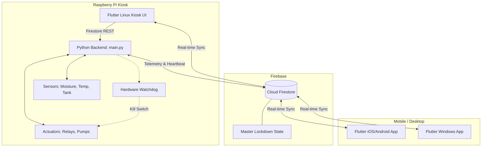
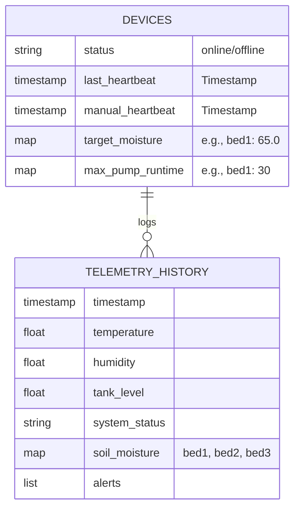
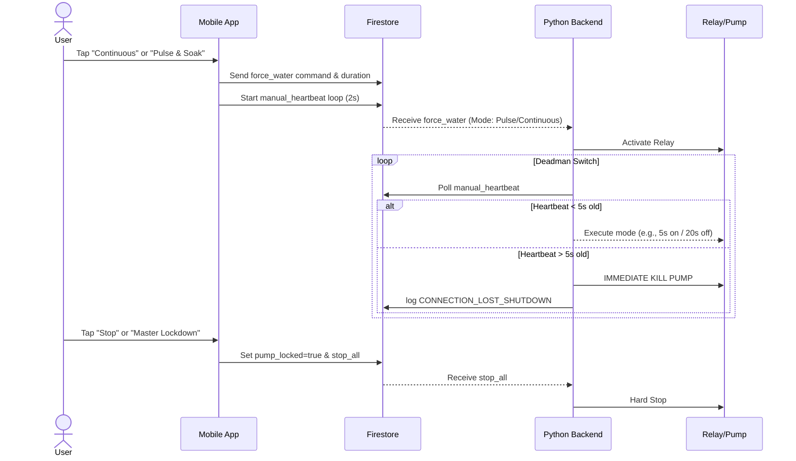

# Smart Sprout: Defense Preparation and Comprehensive Documentation

## Table of Contents
1. [System Overview](#1-system-overview)
2. [System Architecture](#2-system-architecture)
3. [UI/UX Documentation](#3-uiux-documentation)
4. [Features Documentation](#4-features-documentation)
5. [Technical Documentation](#5-technical-documentation)
6. [Hardware Setup](#6-hardware-setup)
7. [Testing & Limitations](#7-testing--limitations)
8. [Defense Q&A Preparation](#8-defense-qa-preparation)
9. [Future Recommendations](#9-future-recommendations)

---

## 1. System Overview

### Project Name
**Smart Sprout**

### Purpose of the System
Smart Sprout is an intelligent, automated, and precision-driven IoT irrigation and plant monitoring system. It provides continuous monitoring of soil moisture, ambient temperature, humidity, and water tank levels. The system enables users to automate watering routines, preventing overwatering or underwatering, through custom thresholds, safety parameters, and remote mobile access.

### Target Users
- **Urban Gardeners and Homeowners**: Managing indoor and outdoor potted plants.
- **Small-Scale Farmers/Agricultural Hobbyists**: Individuals looking for an automated irrigation solution.
- **IoT Enthusiasts and Researchers**: Interested in precision agriculture.

### Platforms Supported
- **Mobile (Android/iOS)**: Premium experience with adaptive shadows, smooth hero transitions, and space-efficient notification system.
- **Windows Desktop**: Adaptive layout with hover effects and specialized scrollbars for mouse/keyboard interaction.
- **Raspberry Pi (Linux Kiosk)**: High-performance lite UI with GPU-safe rendering (no heavy glassmorphism), serving as the primary offline control hub.

### System Architecture Overview
The system relies on a **Zero-Trust Architecture** that bridges a Raspberry Pi local environment and a cloud environment:
- **Frontend**: Flutter applications spanning mobile, windows, and Linux providing UI interactions.
- **Backend (Hardware)**: Python-based backend running on the Raspberry Pi handling hardware inputs/outputs (sensors, relays, pump safety watchdogs).
- **Database / Cloud**: Google Cloud Firestore acting as the central state synchronization layer between the hardware and mobile devices.

### Technologies Used
- **Frontend**: Flutter, Dart, Riverpod (State Management), GoRouter.
- **Backend / Edge**: Python 3, `RPi.GPIO`, `smbus2` (I2C), `adafruit_dht`.
- **Cloud Database**: Firebase / Cloud Firestore.
- **Hardware**: Raspberry Pi 3B (or similar), Capacitive Soil Moisture Sensors, DHT22 (Temp/Hum), ADS1115 (ADC), 4-Channel Relay Module, Submersible Pumps.

---

## 2. System Architecture

### Architecture Diagram (Deployment Diagram)



### Flow Diagrams for Defense

#### 1. System Flow Diagram
1. The **Hardware Unit** (Raspberry Pi) polls plant sensors every X seconds.
2. The **Python Backend** determines if the soil is below the *target_moisture* and initiates watering if the auto-strategy permits.
3. Telemetry is uploaded periodically (Differential Sync) to **Firestore**.
4. The **Flutter Apps** listen to Firestore and update the visual dashboards in real time.
5. A user triggers a manual pump command -> App updates Firestore -> Pi queries Firestore and activates the pump while monitoring the "Dead-Man's Switch" heartbeat.

#### 2. ERD (Entity-Relationship Diagram) - Data Structure
Firestore is a NoSQL database; structured primarily around documents.


#### 3. Sequence Diagram: Mobile Manual Watering


#### 4. Use Case Diagram
```mermaid
usecaseDiagram
    actor User
    actor RaspberryPi_System
    
    User --> (View Dashboard)
    User --> (Adjust Moisture Targets)
    User --> (Start/Stop Manual Watering)
    User --> (View System Health)
    
    RaspberryPi_System --> (Poll Sensor Telemetry)
    RaspberryPi_System --> (Upload Telemetry to Cloud)
    RaspberryPi_System --> (Execute Auto-Watering Pulse & Soak)
    RaspberryPi_System --> (Execute Hardware Safety Kill)
```

---

## 3. UI/UX Documentation

### Screens and Layouts
1. **Main Dashboard**: 
   - Displays weather summaries, tank levels, and the primary "Zone Cards" representing active garden zones.
   - **Interactions**: Tapping a Zone Card reveals detailed historical stats or manual triggers.
   - **Data**: Reads temperature, humidity, and calculated soil moisture relative to calibration.
2. **Control Screen**:
   - Contains smart-toggle pump buttons and the **Master Lockdown Switch**.
   - **Interactions**: Toggles initiate either Continuous or Pulse & Soak manual runs. The Lockdown Switch instantly sets `pump_locked` to true, requiring a manual "Release" to unlock.
3. **Calibration & Settings**:
   - Sliders to configure `SOIL_DRY` and `SOIL_WET` capacities with direct numeric input support.
   - Dual-input fields mapping the *target_moisture* and *max_pump_runtime*.
   - **Interactions**: Optimistic UI immediately reflects values before the network sync executes.
4. **System Health / Alerts**:
   - Visual display of CPU temps, memory utilization, and historical error logs.

### Navigation Flow
- Shell/BottomNavigationBar governs primary tabs: **Home** (Dashboard) <-> **Controls** <-> **Settings** <-> **Health**.

---

## 4. Features Documentation

### 1. Zero-Trust Precision Auto-Watering
- **Description**: The system reads soil capacitance, converts it to a percentage, and waters if it drops below a user-defined threshold until an exact *target_moisture* is met.
- **How it works**: Uses a "Pulse & Soak" methodology. It pulses water for 5 seconds, waits 20 seconds for the soil to absorb and re-evaluates.
- **Error Handling**: Hardcoded max pump runtimes ensure the soil sensor won't keep the pump running forever if it fails or dislodges.

### 2. Manual "Dead-Man's Switch"
- **Description**: Prevents runaway watering during manual operations if the app crashes or network fails.
- **How it works**: The app writes a heartbeat timestamp to Firestore every 2s. The Pi checks this; if the heartbeat is 5 seconds stale, the Pi kills the pump.
- **Error Handling**: Automatically writes `CONNECTION_LOST_SHUTDOWN` to the status log if triggered.

### 3. External Hydration Detection
- **Description**: Identifies if the plant was watered manually (e.g., rain, watering can).
- **How it works**: Compares current soil moisture against previous cycle. If the pump is OFF and moisture jumped >10%, it pushes an alert.

### 4. Hardware Watchdog Safety
- **Description**: Ultimate fail-safe.
- **How it works**: A separate threaded script (`pump_watchdog.py`) directly monitors GPIO pin states. If any relay pin remains HIGH for >30 seconds continuously, it forcibly sets it LOW regardless of the main code state.

---

## 5. Technical Documentation

### Stack Breakdowns
- **State Management**: **Riverpod** is utilized in Flutter, keeping UI precisely synced with streams flowing from Cloud Firestore.
- **Python Edge Logic**: Uses `threading` for asynchronous execution (telemetry loop vs command listening vs watchdog).
- **Security Features**: Implementation restricts hardware network access purely to outbound API connections over HTTPS to Firebase. No local network ports are opened (eliminating local scanning vulnerabilities).
- **Optimized Pi Graphics**: Memory constraints (`imageCache` limited to 50MB) and GPU reliefs (`ColorFiltered` replacing heavy glassmorphism) ensure the Linux Kiosk operates smoothly over 1GB of RAM.

---

## 6. Hardware Setup

### Hardware Components Used
1. **Raspberry Pi 3B / 4** (The core edge controller).
2. **Capacitive Soil Moisture Sensors (v1.2)** (Reads analog capacitance, immune to corrosion).
3. **ADS1115 16-bit ADC** (Converts analog soil sensors to digital I2C for the Pi).
4. **DHT22** (Precision Temperature & Humidity).
5. **4-Channel 5V Relay Module** (Controls high-voltage pump loops via low-voltage Pi GPIO).
6. **Submersible Water Pumps & Tubing**.
7. **Ultrasonic Sensor (HC-SR04)** or float switch for Tank Level measurements.

### Operations Environment
- **OS**: Raspberry Pi OS Lite or Desktop (Debian-based).
- **Auto-start**: Controlled via `systemd` writing to `smartsprout.service`, ensuring Python scripts reboot gracefully on power failure.
- **Kiosk Mode**: Uses `Wayland/Mutter` or `X11` to launch the compiled Flutter Linux application in fullscreen on boot.

---

## 7. Testing & Limitations

### Testing Methodologies Applied
- **Differential Sync Validation**: Tested that telemetry logs only cloud-push when moisture changes by >3% or an alert is thrown, protecting Firestore quota overhead.
- **Watchdog Trigger**: Forcing the pump script into an infinite loop to verify `pump_watchdog.py` kills the GPIO relay independently within 30s.

### Limitations
- **Sensor Drift**: Capacitive sensors slowly drift as soil compactions change over months. They require occasional recalibration in the UI.
- **Local Network Dependency**: While the Zero-Trust architecture blocks exploits, if the home WiFi router goes fully offline without standard DNS, the mobile App won't sync (the Pi local touch app *will* maintain operation).
- **Water Capacity limitation**: 5-gallon tank runs dry entirely dependent on the pump draw limit—measuring tank volume is critical.

---

## 8. Defense Q&A Preparation

**Q1: Why rely on Cloud Firestore instead of local MQTT/Bluetooth?**
*Answer:* **Zero-Trust Architecture & Scalability.** Local MQTT servers introduce local network attack vectors and require users to manage complex router setups. Utilizing Firestore guarantees that data is encrypted in transit and the system can be scaled and controlled securely from anywhere in the world without exposing network vulnerabilities.

**Q2: How do you prevent the pumps from flooding the user's house?**
*Answer:* We implemented a multi-layered safety strategy:
1. **Master Lockdown Switch**: A global software kill-switch that locks the system's state.
2. **Pulse & Soak System**: Reduces hydraulic pressure and prevents soil saturation runoff.
3. **Dead-Man's Switch**: Kills the pump if the mobile app disconnects for >5 seconds during manual operation.
4. **Hardware Watchdog**: An isolated script directly monitoring GPIO limits duration to 120s regardless of software logic.

**Q3: What happens if the internet goes down?**
*Answer:* The system follows a **Local-First** philosophy. The Raspberry Pi maintains its scheduled auto-watering routines entirely offline. While the mobile app loses remote control, the physical touchscreen kiosk on the Pi remains fully functional for manual triggers and calibration.

**Q4: How did you handle the UI performance bottleneck on the low-powered Raspberry Pi?**
*Answer:* Platform-specific optimizations. We utilized Flutter's `Platform.isLinux` conditions to disable heavy GPU calculations like BackdropFilters (glassmorphism), disabled deep slide animations utilizing `NoTransitionPage`, and restricted the image cache size significantly. 

**Q5: How is this system scalable?**
*Answer:* Expanding the system is horizontally scalable through Firebase. By appending a new `device_id`, the user can buy a second Smart Sprout kit, place it in their backyard, and manage it seamlessly from the exact same mobile app by merely toggling device selection. 

---

## 9. Future Recommendations

1. **Admin & Analytics Dashboard**: Implementing a web-based comprehensive reporting tool utilizing Firebase BigQuery to assess water savings compared to traditional irrigation over a year.
2. **AI Integration**: Taking weather APIs (like OpenWeatherMap) and running an edge predictive model to halt watering routines if rain or high humidity environments are expected.
3. **Advanced Offline Mode**: Developing an ad-hoc Bluetooth Low Energy (BLE) fallback to securely relay credentials if Wi-Fi degrades.
4. **Data Backup/Recovery Plans**: Automating nightly Firebase storage exports to GCP Cloud Storage.
5. **Push Notifications**: Utilizing Firebase Cloud Messaging (FCM) to trigger iOS/Android banner notifications the moment the `system_status` hits `tank_low` or `CONNECTION_LOST_SHUTDOWN`.
6. **User Accounts & Role-Based Access**: Multi-tenancy configurations so a family can have 'admin' rights (changing parameters) vs 'viewer' rights (just viewing stats).
